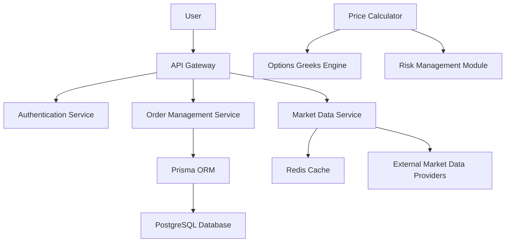

# RaboBackend
# 🚀 Rabovel: Advanced Options Trading Platform

## Overview

Rabovel is a sophisticated, scalable backend platform for options trading, built with cutting-edge technologies to provide robust, high-performance financial trading capabilities.

## 🌟 Key Features

### 1. Comprehensive Options Trading
- Real-time options contract management
- Advanced order types (Market, Limit, Stop, Stop-Limit)
- Detailed position tracking
- Complex risk management

### 2. Advanced Financial Modeling
- Full Greek calculations (Delta, Gamma, Theta, Vega, Rho)
- Implied volatility tracking
- Margin requirement calculations
- Exposure management

### 3. Robust Infrastructure
- Microservices architecture
- Containerized deployment
- Horizontal scalability
- High availability design

## 🛠 Technology Stack

### Backend
- **Language**: TypeScript/Node.js
- **Framework**: Express.Js
- **ORM**: Prisma
- **Database**: PostgreSQL
- **Caching**: Redis

### DevOps
- **Containerization**: Docker
- **Orchestration**: Docker Compose
- **Monitoring**: Prometheus, Grafana

### Market Data
- **Real-time Data**: WebSocket Integrations
- **Price Calculation**: Black-Scholes Model
- **Market Feeds**: Alpha Vantage, IEX Cloud

## 📦 System Architecture



## 🚀 Quick Start

### Prerequisites
- Node.js 18+
- Docker
- Docker Compose
- PostgreSQL
- Redis

### Installation

1. Clone the repository
```bash
git clone https://github.com/Rabovel/RabovelBackend.git
cd rabovelBackend
```

2. Copy environment template
```bash
cp .env.example .env
```

3. Configure environment variables
- `DATABASE_URL`: PostgreSQL connection
- `REDIS_URL`: Redis connection
- `JWT_SECRET`: Authentication secret
- `MARKET_DATA_API_KEY`: Market data provider key

4. Start the application
```bash
docker-compose up -d
```

5. Initialize database
```bash
docker-compose exec api npx prisma migrate deploy
docker-compose exec api npx prisma generate
```

## 🔐 Authentication

- JWT-based authentication
- Role-based access control
- Multi-factor authentication support
- OAuth2 integration

### User Roles
- `TRADER`: Standard trading permissions
- `PROFESSIONAL`: Advanced trading capabilities
- `ADMIN`: Full system management

## 📊 Key Endpoints

### Authentication
- `POST /auth/register`
- `POST /auth/login`
- `POST /auth/refresh-token`

### Trading
- `GET /options/contracts`
- `POST /orders`
- `GET /positions`
- `GET /portfolio/risk-analysis`

### Market Data
- `GET /market/quotes`
- `GET /market/options-chain`
- `GET /market/volatility`

## 📈 Performance Metrics

### System Requirements
- **CPU**: 4 cores
- **RAM**: 8GB
- **Storage**: 100GB SSD
- **Network**: 100 Mbps+

### Performance Targets
- Order Execution: < 50ms
- Market Data Update: < 100ms
- Risk Calculation: < 500ms

## 🛡️ Security Features

- End-to-end encryption
- Regular security audits
- Rate limiting
- IP whitelisting
- Comprehensive logging
- Automated vulnerability scanning

## 🧪 Testing

### Test Coverage
- Unit Tests: %
- Integration Tests: %
- E2E Tests: %

### Running Tests
```bash
# Unit Tests
npm run test

# Integration Tests
npm run test:integration

# E2E Tests
npm run test:e2e
```

## 📝 Logging & Monitoring

- Centralized logging with ELK Stack
- Real-time performance monitoring
- Alerts for critical system events
- Grafana dashboards for visualization

## 📦 Deployment

### Supported Environments
- Development
- Staging
- Production

### Deployment Options
- Docker Swarm

## 🔜 Roadmap

- [ ] Options strategy builder
- [ ] Machine learning risk prediction
- [ ] Advanced charting
- [ ] Social trading features
- [ ] Cryptocurrency options support

## 👥 Contributing

1. Fork the repository
2. Create feature branch
3. Commit changes
4. Push to branch
5. Create pull request

### Contribution Guidelines
- Follow TypeScript style guide
- Write comprehensive tests
- Update documentation
- Maintain code coverage

## 📄 License

MIT License

## 🆘 Support

For issues, please open a GitHub issue or contact:
- Email: support@rabovel.com
- Discord: https://discord.gg/rabovel

## 📚 Documentation

Comprehensive API and system documentation available at:
https://docs.rabovel.com

---

**Disclaimer**: This platform is for Trading purposes. Always consult financial advisors before trading.
